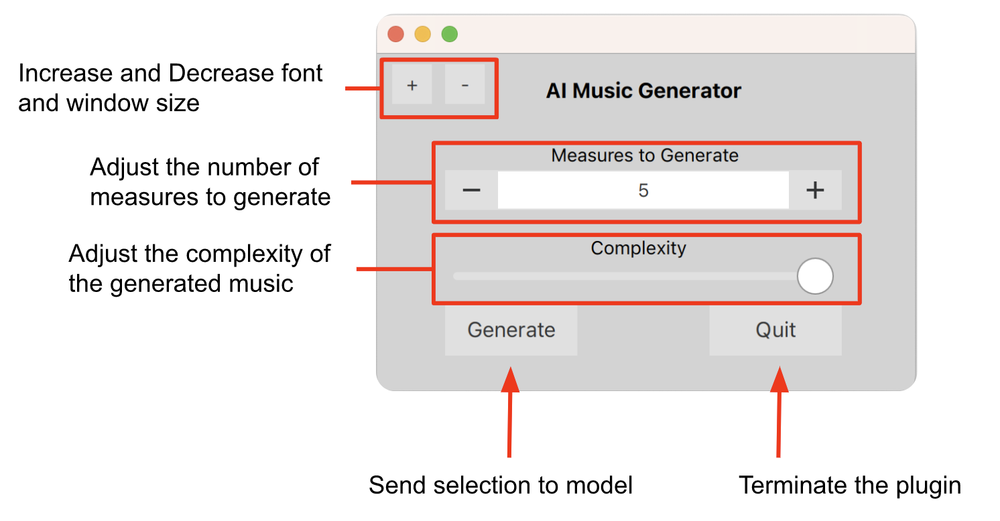

# AI Music Generator Developer Readme

This readme is designed for developers who wish to understand the underlying structure and advanced information of the plugin's functionality.

## MuseScore Plugin

### Basic information

In MuseScore, it is not possible to import and export portions of a score through MIDI, which is necessary to train the model on a user-selected seed melody. 

### Limitations and Bugs

The AI Music Generator plugin has the following limitations and bugs:

- The user must begin their selection at the beginning of a measure.
- Only notes longer than 32nd notes are supported.
- Triplets or any other kind of tuplet are not supported.
- The MIDICSV program cannot be run in the MuseScore plugin itself.
- With the current model, only one staff/melody can be generated at a time. However, the plugin still supports multi-staff input/output.

## MIDICSV

Since the model is trained on MIDI data, a way to transmit data from MuseScore to the model and back was needed while preserving all relevant note information. MIDICSV is a Python library adapted from John Walker's application by Tim Wedde. It can translate between MIDI data and a custom CSV format, allowing the model to export score data as CSV and convert it into MIDI data that can be read by the model. When the model exports its generated continuation as MIDI, it can be converted back into CSV, which can be read back into the MuseScore plugin.

The converted CSV format for the model requires four main elements: track, tick, pitch, and velocity. To indicate the beginning of a note using this format, the note's velocity must be greater than zero, while it is set to zero to signify the end of the note.

Example:
`1, 0, Note_on_c, 0, 72, 80
1, 455, Note_on_c, 0, 72, 0`
As we can see, all other identifying information for this quarter note stays constant, but the last value (the velocity) changes to 0 to end the note at tick 455. In MuseScore and most other composition software, a quarter note should actually have a length of 480 ticks. MIDICSV slightly shortens the note to make it sound more realistic on playback. This is perfectly fine when exporting to the model, as it gets converted back into MIDI, but it does cause some problems when trying to import it back to the score in the CSV format. In order to combat this issue, we can round this value up to the nearest 60 ticks, which is the duration of a 32nd note.

### Reading from the Score

In MuseScore, there are two main ways to access notes from a selection: with the cursor and by iterating through the current selection. Although they can interact with each other, only the cursor method provides the necessary information due to the built-in class hierarchy in the API. By using the cursor position to access each note, we can retrieve the following relevant information from the API for each note: the current tick position, the note duration, the pitch, and the track it appears on. The ending tick for a note can be calculated by adding the current tick position to the note duration. In order to access the next note on a given track, we can simply run `cursor.next()`, which advances the cursor to the next Segment. In the MuseScore API, each note belongs to a chord, even if it is a singular note. So, to access every note at a given Segment for a track, we have to iterate through the chord itself and add the note's properties to an array. To access other instruments/staves in the score, we have to manually change the staff that the cursor points to by changing the `cursor.staffIdx` property.

When converting the data to CSV format, there are a few issues to consider. The tick position is absolute, not relative, so if the user selects the third and fourth measures in a score, the converted MIDI data will have 2 empty leading measures. To fix this issue, we subtract the tick value of the beginning of the measure of the selection from every tick value in the CSV. Additionally, the start ticks and end ticks for the same note may not be next to each other if other notes are played while one note is already playing. To fix this issue, we can sort each row of notes by their tick and then their velocity value.

### Writing to the Score

Writing to the score is similar to reading from the score, using the cursor. After importing the result from the model as a CSV, a new cursor is created and its tick position is set immediately after the end of the user selection. The CSV is parsed by splitting it up by line and then by type. If it is the beginning of a note (has a velocity greater than 0), it is parsed into its track ID, tick value, and pitch. The tick value of the end of the note is found by scanning through the succeeding lines of the array to find a line where the pitch is the same, but the velocity is 0. After calculating the duration by subtracting the tick value of the end of the note from the start of the note, the `roundNote` function is used to round the duration to the nearest 60 ticks. The cursor properties (duration, tick value, pitch, and track) are set accordingly. Before adding the note to the score, it is checked whether the note is part of a chord. If the tick value for the existing note is not equal to the tick value of the last note, the note is added as an individual note; otherwise, it is added as a chord.

## Interactive Window

To provide an easy way for users to specify parameters for the model, an interactive window is created using QML. The interactive window allows users to adjust font and window size, specify the number of measures to generate, start the generation process, and quit the plugin. The window is set up with its own scale factor to resize text, buttons, and the SpinBox. The +/- buttons in the top left corner increase or decrease the global scale factor for fonts and positions.

In order to terminate the plugin properly, `Qt.quit()` cannot be located in the main body of the code; it can only be within the `onClicked` portion of the Quit button. Additionally, `Qt.quit()` does not actually close the window, so `main.close()` must be run separately. Buttons cannot directly execute code or perform waits in the `onRun` portion of the plugin, so any code that needs to be executed on button press must be stored in the `onClicked` portion of the button.

## Model - Magenta

We are using the Magenta library, hosted on GitHub, to employ a pre-trained neural network for music generation in the plugin. The chosen model is the Melody RNN model, a simple RNN model that takes input in the note sequence format specific to the Magenta team. The Python note-seq library is used for implementing the note sequence format. The model is initialized with the stored pretrained model, `basic_rnn`. Once a seed sequence is provided by the plugin, the `g.generate` function is called with the given seed sequence, tempo, number of steps, and desired temperature. This function calls on the model to generate a note sequence and returns only the generated part of the note sequence.

The most helpful resources for working with Magenta are the Magenta website and example Google Colab notebooks provided by the developers.

## Data Conversion

Since the input and output of the MuseScore plugin must be in CSV format, extensive pre- and post-processing is performed by the generator before and after the neural network generates a sequence. The provided CSV file from the plugin is converted to MIDI and then to the note sequence format required by the model using the `py-midicsv` library and the note-seq library. The generator extracts the number of measures to be generated and the tempo of the song from a comment in the first line of the CSV file before conversion.

After generating a new note sequence, the input sequence is removed so that only the generated section is converted back to MIDI and then again to CSV using the `py-midicsv` library and the note-seq library. The result is stored in a file named `out.csv`, which can be read and displayed in MuseScore.

The conversion process is implemented in the generator class with functions `seq_proto_to_csv` and `csv_to_seq_proto`. Another function is used to parse the comment at the start of the CSV file, which contains the number of measures to be generated and the tempo of the song.

## Monitoring for MuseScore Plugin Generation Request

To enable communication between the MuseScore plugin and the Python script running the generator, the plugin continuously checks the CSV file written by the MuseScore plugin to see if a new note sequence generation has been requested. The generator records the time that the CSV file was last edited when initialized. If the last edited time changes for the file, indicating a new request, the generator generates a new sequence and writes it to the `out.csv` file.

This logic is implemented in the monitor class and the `while (True)` loop in the main code, continuously waiting for the file to be edited.
