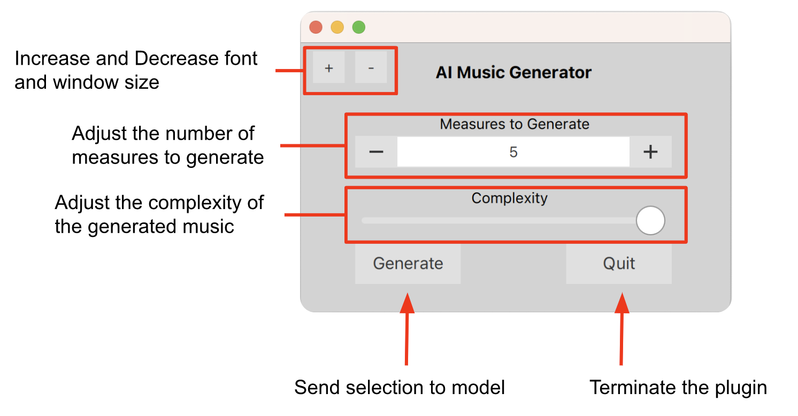

# AI Music Generator User Manual

## Software Requirements
* [MuseScore 3.x](https://musescore.org/en/3.6.2), 3.6.x is preferred
* macOS 11 or later
* [Magenta](https://github.com/magenta/magenta/blob/main/README.md)
* [py_midicsv](https://pypi.org/project/py-midicsv/)
* Our GitHub library

## Setting up the Model
1. Open Terminal and install our GitHub library using this command: `git clone https://github.com/abbynewcomb/MuseScore-Music-Generation-Extension.git` and navigate to its main directory. 
2. Download the MelodyRNN model from [here](http://download.magenta.tensorflow.org/models/basic_rnn.mag) into this directory. 
3. Run the `source activate magenta` command to activate the magenta environment.

## Using the Model
1. Run the terminal command `python generator.py` in the main directory of our GitHub. This will initialize the model. 
2. After the model is initialized, it will wait for the MuseScore Plugin to request a generated sequence. Keep this terminal window running while the plugin is in use.
3. To exit the generator, press Ctrl-C. 

## MuseScore Plugin

### Installing the Plugin
1. Install the plugin file `AIMusicGenerator.qml` to your `/Users/[username]/Documents/MuseScore3/Plugins/` directory.
2. Navigate to Plugins>Plugin Manager at the top of your screen.
3. Check off `AI Music Generator` in the window on the left, and press OK.

### Running the Plugin
1. Follow the directions in this document under Model→Using the Model.
2. Select the portion of the score you wish to be the “seed melody” for the model with your cursor. Select full measures only, and make sure there are enough empty measures after the selection for the resulting generation to go.
3. In the window itself, select how many measures you want the model to generate with the - and + buttons. Note that more measures will take longer to generate.
4. Adjust the complexity of the music you wish to be generated. The slider goes from less complex on the left to more complex on the right, and has 2 possible states.
5. When you are ready, press the generate button and wait for the model to return the result.
6. Repeat as necessary, and press Quit to stop.

## Limitations
* Only notes longer than 16th can be generated by the model.
* Triplets or any other kind of tuplet cannot be read from the model.
* With the current model, only one staff/melody can be generated at a time. However, the plugin still supports a multi-staff input/output.
